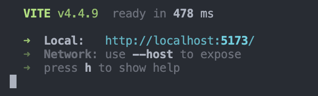
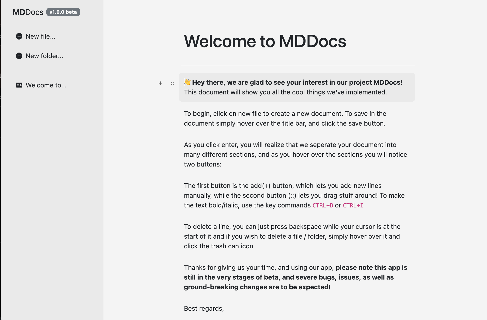

# MDDocs

## Introduction

MDDocs is an open sourced text editor with the goal of providing a community built planner and document editor. The current version of MDDocs features functionality similar to the basics of editors like Notion

## Table of Contents

- [Installation](#installation)
- [Usage](#usage)
- [Contribution](#contribution)
- [License](#license)
- [Contact/Support](#contactsupport)
- [Acknowledgments](#acknowledgments)

## Installation

Currently, our application isn't quite ready for it's beta release as it depends on a very basic `localStorage` system for saving the files.

1. To begin, to use our application you may download it from our official Github page by cloning it.

2. To initialize this project, open the root directory of the project (with package.json, etc.) and run `npm run dev` to see what our project is like.  

3. Finally, navigate to the local server created by `npm run dev` and try out some of the features of our application.

## Contribution

Interested in contributing? Here's how you can help:
- Open and issue with a prefix
- Open a branch
- Make a pull request

For more detailed information on contributions, see the [CONTRIBUTING.md](CONTRIBUTING.MD).

## License

This project is licensed under the the MIT license (MIT). For more details, see the [license](LICENSE.txt).

## Contact/Support

For any inquiries, issues, or support related to this project, reach out at [alantheking0899@gmail.com].

## Acknowledgements

- React & Vite: For the frontend developement.
- Bootstrap: For CSS.
- ChatGPT: Solving bugs and configuration issues, suggesting solutions and much of the documentation
- React-contenteditable & sanitize-html: Rich text editing